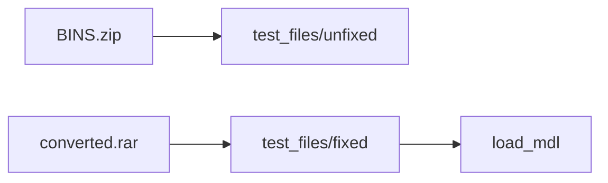

# Community MDL load regression test (BINS + converted)

## Source archives (before/after)

| Archive           | Path                                     | Role                                                                |
| ----------------- | ---------------------------------------- | ------------------------------------------------------------------- |
| **BINS.zip**      | `C:\Users\boden\Downloads\BINS.zip`      | Unfixed/original models that fail in current KotorBlender           |
| **converted.rar** | `C:\Users\boden\Downloads\converted.rar` | Fixed versions (converted, K2); used for “loads successfully” tests |

Goal: use these pairs so we can write unit tests and identify where the binary reader is being too strict. Files must be presentable for structural diagnosis.

## Step 1: Extract into test_files (first todo)

- Create `[test/test_files/](test/test_files/)`.
- **Unfixed:** extract `BINS.zip` into `test/test_files/unfixed/` (or `bins/` — keep layout flat enough that each `.mdl` has a sibling `.mdx`).
- **Fixed:** extract `converted.rar` into `test/test_files/fixed/`.
- Add `[test/test_files/README.md](test/test_files/README.md)` stating:
  - `unfixed/` = originals from BINS.zip (for diagnosis).
  - `fixed/` = converted.rar (K2, fixed); tests assert these load.
  - Source paths above so others can re-extract if needed.

Ensure every `.mdl` used in tests has a sibling `.mdx` in the same directory; `[MdlReader](io_scene_kotor/format/mdl/reader.py)` requires it.

## Context: "Invalid MDL signature" and reader strictness

`[io_scene_kotor/format/mdl/reader.py](io_scene_kotor/format/mdl/reader.py)`:

1. **Sibling MDX**: same basename as `.mdl` — missing `.mdx` → `MDX file '...' not found`.
2. **File header**: first little-endian `uint32` must be **0** in `load_file_header`; otherwise `Invalid MDL signature`.

The exporter writes that leading zero in `[save_file_header](io_scene_kotor/format/mdl/writer.py)`. Unfixed BINS likely use a different header or variant; comparing unfixed vs fixed binaries (and fixed vs what the reader expects) is how we diagnose structural issues.

## Test style (this repo)

Use **Blender background** scripts under `[test/blender/](test/blender/)`: `test_`* functions, `_Op` mock, addon enable, `run_tests()` — same pattern as `[test_mdl_minimal.py](test/blender/test_mdl_minimal.py)`. No host `pytest` + `bpy`; `[run_blender_tests.sh](test/run_blender_tests.sh)` runs all `test/blender/test_*.py`.

## Implementation steps (after extract)

1. **Blender test module** (e.g. `[test/blender/test_community_mdl_load.py](test/blender/test_community_mdl_load.py)`)
  - Paths: `os.path.join(WORKSPACE_ROOT, "test", "test_files", "fixed")` (and optionally unfixed for future diagnosis).
  - **Skip gracefully** if `test_files/fixed` (or the archive extract) is missing — e.g. `sys.exit(0)` with a print so CI without assets still passes.
  - For each `.mdl` in `test_files/fixed` that has a sibling `.mdx`: `_clear_scene()`, `load_mdl(_op, mdl_path, ImportOptions(...))`, assert at least one `kb.dummytype == DummyType.MDLROOT` (or equivalent).
  - `run_tests()` and `if __name__ == "__main__": sys.exit(0 if run_tests() else 1)`.
2. **Makefile (optional)**
  - Target `test-community-mdl` that runs the new script for fast iteration.
3. **Diagnosis (optional)**
  - Document or add a small script to diff unfixed vs fixed (e.g. first N bytes, key offsets) to guide where the reader is too strict.

## Success criteria

- Extracting `BINS.zip` and `converted.rar` into `test/test_files/` yields clear unfixed vs fixed layout.
- `blender --background --python test/blender/test_community_mdl_load.py` exits 0 (skips if no assets; passes when fixed assets present and load).
- `make test` includes the new file via existing glob in `[test/run_blender_tests.sh](test/run_blender_tests.sh)`.

## Licensing

Game/mod binaries in `test_files/` may be proprietary. If they cannot be committed, use **skip when missing** and document re-extraction from the above paths (or a `DATA_DIR`-style env) for local/CI runs that include these tests.

---

# PyKotor MDL/MDX and GL tests (port into KotorBlender)

## Source (PyKotor repo)

- **Repo path:** `C:/GitHub/PyKotor`
- **MDL test files:** `Libraries/PyKotor/tests/test_files/mdl/`
  - Pairs: `c_dewback.mdl/.mdx`, `dor_lhr02.mdl/.mdx`, `m02aa_09b.mdl/.mdx`, `m12aa_c03_char02.mdl/.mdx`, `m12aa_c04_cam.mdl/.mdx`
- **MDL test module:** `Libraries/PyKotor/tests/resource/formats/test_mdl.py` (pytest + unittest)
- **GL test modules:** `Libraries/PyKotor/tests/gl/`
  - `test_async_loader_texture_txi_none.py` — TPC without TXI parses (async_loader._parse_texture_data)
  - `test_texture_loader_core.py` — TPC mipmap serialize/deserialize (no Qt/GL)
  - `test_frustum_culling.py` — Camera, Frustum, culling (requires pykotor.gl)
  - `test_camera_controller.py` — CameraController, InputState (requires pykotor.gl)

## What to copy and where

| What               | From                                                                                    | To (kotorblender)                                            |
| ------------------ | --------------------------------------------------------------------------------------- | ------------------------------------------------------------ |
| MDL/MDX binaries   | PyKotor `tests/test_files/mdl/*.{mdl,mdx}`                                              | `test/test_files/pykotor_mdl/` (or `test_files/mdl/`)        |
| MDL test behaviour | PyKotor `test_mdl.py`                                                                   | `test/blender/test_pykotor_mdl.py` (and/or split by concern) |
| GL / TPC tests     | PyKotor `tests/gl/test_texture_loader_core.py`, `test_async_loader_texture_txi_none.py` | `test/blender/` or `test/` (see below)                       |

## Porting PyKotor MDL tests (same assertions, Blender idiom)

Do **not** copy PyKotor code 1:1 (different APIs: `read_mdl`/`MDL` vs `load_mdl`/Blender scene). Implement tests that **assert the same behaviour** using this repo’s stack:

- **Binary I/O:** For each PyKotor test file in `test_files/pykotor_mdl/`: load via `load_mdl(_op, mdl_path, ImportOptions(...))`; assert model loaded (e.g. at least one `kb.dummytype == DummyType.MDLROOT`), root present, node count > 0, and (where applicable) at least one mesh node / texture names / lightmaps (if exposed in Blender).
- **Node hierarchy:** After load, assert root in `all_objects` or equivalent, and that node names / child counts are consistent (e.g. traverse and count).
- **Mesh data:** Assert at least one object with mesh data; optionally vertex/face counts or texture slot if available.
- **Round-trip:** Load MDL → `save_mdl` to temp file → `load_mdl` again; assert root (and optionally node count / name) preserved (mirror PyKotor’s roundtrip intent; KotorBlender has no ASCII MDL, so binary round-trip only).
- **Edge cases:** Missing file → expect exception or operator report; empty/minimal scene behaviour if applicable.
- **Performance:** Optional “fast load” test only if KotorBlender adds a fast path; otherwise skip or document.

Run these as **Blender background** scripts (`test/blender/test_pykotor_mdl.py` or similar), same pattern as `test_mdl_minimal.py`: `_Op` mock, addon enable, `run_tests()`, exit 0/1. Skip gracefully if `test_files/pykotor_mdl/` is missing so CI without assets still passes.

## Porting PyKotor GL tests

- **test_texture_loader_core.py:** Tests TPC mipmap serialization format (struct pack/unpack). KotorBlender has `io_scene_kotor/format/tpc/` (reader). Port tests that verify **equivalent** behaviour: e.g. that our TPC reader produces mipmap dimensions/format/data consistent with what the test expects, or add a small pure-Python test (under `test/` or `test/blender/`) that exercises our TPC reader on a fixture and asserts format/size. No OpenGL required.
- **test_async_loader_texture_txi_none.py:** Tests that a TPC without TXI still parses with defaults. If our addon has a code path for “TPC without TXI”, add a test that loads such a fixture and asserts no error and sensible defaults; otherwise document as future work.
- **test_frustum_culling.py / test_camera_controller.py:** Depend on `pykotor.gl` (Camera, Frustum, OpenGL). KotorBlender has no equivalent viewport/GL stack. **Do not implement** these in KotorBlender unless we add a GL/viewport layer. In the plan: “Copy” = add a short note or a skipped test that references PyKotor and states these are out of scope (or add a placeholder `test_gl_placeholder.py` that skips with a message). “Any and all gl tests” is satisfied by: (1) porting GL-related **format** tests (TPC/texture) that apply to our codebase; (2) explicitly documenting or skipping the rest.

## Test runner (pytest vs Blender idiom)

This repo uses **Blender background** scripts (`blender --background --python test/blender/test_*.py`) and `test/run_blender_tests.sh`; no host `pytest` with `bpy`. Keep that as the primary idiom:

- New MDL/TPC tests live under `test/blender/` and are run by the existing runner.
- Optionally, add a **thin pytest** entrypoint (e.g. `test/test_blender_invoke.py`) that `subprocess.run`s Blender on selected scripts and interprets exit code, so `pytest test/` can drive Blender tests without changing the scripts themselves. Only add this if you want a single `pytest` entrypoint; otherwise the Makefile + shell runner is enough.

## Todo summary (PyKotor port)

1. **pykotor-test-files:** Copy `C:/GitHub/PyKotor/Libraries/PyKotor/tests/test_files/mdl/` contents into `test/test_files/pykotor_mdl/` (or `test_files/mdl/`).
2. **pykotor-mdl-tests:** Add `test/blender/test_pykotor_mdl.py` (or split) that implements the same assertions as PyKotor `test_mdl.py` (load all, hierarchy, mesh, roundtrip, edge cases) using `load_mdl` and Blender scene.
3. **pykotor-gl-tests:** Port texture/TPC tests that apply to our TPC reader; add skipped or documented placeholders for camera/frustum/OpenGL tests.

