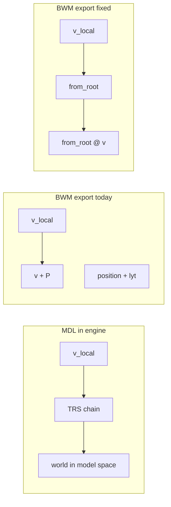

## Plan todo list

Track these when you start implementation (all pending until then):


| ID                    | Task                                                                                                                                                                |
| --------------------- | ------------------------------------------------------------------------------------------------------------------------------------------------------------------- |
| `bwm-peek-vertices`   | Export vertices as **from_root @ local**; drop **lytposition** from the written positions; align **BWM header position** with that layout and sanity-check in-game. |
| `bwm-normals-header`  | **Rotate normals** with the linear part of **from_root**; fix **save_header** for area WOK and for **PWK/DWK** so headers match baked geometry.                     |
| `tests-wok-transform` | **New Blender test**: nested transform on parent, export **.wok**, compare stored verts to expected model-space positions.                                          |
| `verify-ci-pr`        | **ruff** + `**test/run_blender_tests.sh`**; optional Holocron pass; `**gh pr create`** using the plan’s suggested title/body.                                       |


## Enhancement summary

**Deepened on:** 2026-03-17  
**Sections enhanced:** Root cause, implementation, files/tests, new PR/CI section  
**Research:** `repo-research-analyst` on [kotorblender](https://github.com) repo layout, CI, and BWM test gaps  

### Key improvements added to this plan

1. **CI-aligned verification commands** so the PR matches what GitHub Actions runs (Blender 4.2 + `run_blender_tests.sh`).
2. **Explicit risk callout:** almost no existing BWM regression tests—new test is high leverage.
3. **Copy-paste GitHub CLI workflow:** suggested PR title, plain-language body, and `gh pr create` / follow-up commands (run these after implementation; do not open the PR until code and tests are done).

### New considerations

- Repo has **no CONTRIBUTING.md or PR template**—the suggested body below fills that gap.
- **Blender version:** CI pins **4.2.0**; README mentions wider support—smoke-test locally on your target Blender if not 4.2.
- **PWK/DWK** may need extra Holocron/engine checks beyond area WOK.

---

# Fix WOK walkmesh transform mismatch vs MDL

## Root cause

**MDL geometry** stores mesh vertices in **object-local** space and applies **position, orientation, scale, and every parent node** at runtime (and when computing bounds via `[from_root @ Vector(vert)](io_scene_kotor/format/mdl/writer.py)` around lines 736–741).

**BWM export** in `[io_scene_kotor/format/bwm/writer.py](io_scene_kotor/format/bwm/writer.py)` (`peek_vertices`, lines 155–173) builds file vertices as:

```python
vert[i] + self.geom_node.position[i] + self.geom_node.lytposition[i]
```

That is **translation-only**. It is **not** equivalent to `from_root @ vert` whenever the walkmesh node (or any ancestor under the MDL root) has non-identity rotation, non-uniform scale, or a parent chain that contributes transform—matching your symptoms (offset; apparent scale mismatch when rotation/scale live on parents or before apply).

**Secondary issue:** `[lytposition](io_scene_kotor/scene/modelnode/aabb.py)` is set on import by `compute_lyt_position` to align vanilla WOK vs MDL in Blender. It is **only** added again on WOK export. After you resize/edit the mesh, that stored offset is **stale** and shifts walkmesh further.




### Research insights (root cause)

**Best practices**

- Treat **one source of truth** for “where is this vertex in model space?”—reuse the same `from_root @ Vector(vert)` idea already used for MDL bounding box computation.
- **Normal vectors** under non-uniform scale: use inverse-transpose of the linear 3×3 for mathematically correct face normals; if you only support uniform scale on walkmesh nodes, normalizing `R @ n` is often enough—document the assumption.

**Edge cases**

- **Identity `from_root`:** baking should match current translation-only behavior when the chain is pure translation and header position strategy is chosen to preserve round-trip.
- **Stale `lytposition`:** stop baking it into exported vertices; optionally reset or document on export so re-import does not accumulate error.

**Performance**

- Vertex count for walkmeshes is modest; matrix multiply per vertex is negligible compared to I/O.

---

## Recommended implementation

1. **Bake model-space vertices in `BwmWriter.peek_vertices`**
  - For each `geom_node.verts[i]`, compute `world = geom_node.from_root @ Vector(vert)` (same convention as MDL bounding / rendering).
  - **Do not** add `lytposition` to exported positions (it is an import-time alignment hack, not part of the game’s transform chain once you author in Blender). Optionally: document or zero `kb.lytposition` on export to avoid confusion.
2. **Header `position` vs stored vertices (round-trip + game compatibility)**
  - `[BwmReader.load_vertices](io_scene_kotor/format/bwm/reader.py)` does `local = file - header_position`.
  - After the change, file vertices are **absolute in MDL-root space** (not “mesh local + object location”). To keep a consistent interpretation:
    - **Set header `position` to `(0, 0, 0)`** and write `file_vert = (from_root @ vert)` (plus any agreed lyt handling = none).
    - On re-import into Blender, the walkmesh mesh will sit at **origin** with **world-space coordinates in vertex data**—visually aligned with the model **if** the MDL root is at the same place (same as today’s scene setup). This matches “what the game needs” more closely than the current sum.
  - **Risk:** If Holocron or the game assumes a non-zero WOK header position for some modules, validate against a few vanilla files and one re-export round-trip. If anything breaks, fallback is to solve for a single header translation only when `from_root` is pure translation (detect approximate rotation identity) and keep matrix path otherwise.
3. **Face normals**
  - `[peek_faces](io_scene_kotor/format/bwm/writer.py)` copies `geom_node.facelist.normals` unchanged. If vertices are rotated by `from_root`, **rotate normals** by the linear part of `from_root` (for uniform scale, `normal.rotate(rotation)` / 3×3 upper-left normalized).
4. **PWK/DWK**
  - Same writer path; DWK header also uses `position` and use vectors—after changing vertex bake, re-check `[save_header](io_scene_kotor/format/bwm/writer.py)` (lines 308–318) so `abs_use_vec`* / `position` remain consistent with how the engine expects door/placeable walkmeshes (may need the same `(0,0,0)` header + baked verts, or engine-specific tweaks).
5. **Tests**
  - Add a Blender-headless test (pattern like `[test/blender/test_mdl_structures.py](test/blender/test_mdl_structures.py)`): build MDL root → dummy (rotated/translated) → AABB walkmesh with known local verts; export MDL+WOK; assert every `from_root @ v` equals the vertex written to `.wok` (read back with position 0). Optionally compare MDL `from_root @ v` to WOK stored vert for the same object.

### Research insights (implementation)

**Repo-specific risks** (from repo-research-analyst)

1. **Almost no BWM regression coverage today**—many MDL tests set `export_walkmeshes = False`. The new walkmesh transform test is essential before merge.
2. `**lytposition` and header fields**—easy to double-count or leave stale; keep export path explicit and tested.
3. **CI uses Blender 4.2.0 only**—run the same script locally before opening the PR.

**Quality / simplicity**

- Prefer a single code path in `peek_vertices` for WOK and PWK/DWK unless engine behavior forces a branch; branch only where DWK use-vectors or header semantics differ.

---

## Files to touch


| File                                                                         | Change                                                                                                                                                             |
| ---------------------------------------------------------------------------- | ------------------------------------------------------------------------------------------------------------------------------------------------------------------ |
| `[io_scene_kotor/format/bwm/writer.py](io_scene_kotor/format/bwm/writer.py)` | Matrix-multiply verts in `peek_vertices`; rotate normals in `peek_faces`; header `position` strategy (likely zeros for WOK); drop `lytposition` from vertex offset |
| `[test/blender/](test/blender/)` (new or extended)                           | Regression test for nested transform + scale                                                                                                                       |


---

## Verification before PR (matches CI)

From repo `.github/workflows/ci.yml`:

1. `python -m py_compile` on `io_scene_kotor/**/*.py` (or rely on CI).
2. `ruff check --select E9,F821,F823 io_scene_kotor/` (with dev requirements installed).
3. **Blender tests:** `BLENDER=/path/to/blender-4.2 bash test/run_blender_tests.sh`
  - Optional filter: `bash test/run_blender_tests.sh --filter <pattern>`  
  - Windows: Git Bash or WSL with `BLENDER` pointing at the executable.

---

## Pull request: GitHub CLI (after implementation)

Run on a branch with your commits (not from this planning step). Authenticate first: `gh auth login`.

### Suggested PR title (plain language)

```text
Fix walkmesh export so WOK matches MDL scale and position in-game
```

### Suggested PR body (paste into `gh pr create --body-file` or heredoc)

Use this verbatim or adjust if you split WOK vs PWK/DWK work:

```text
## What was wrong
Walkmeshes (.wok and related BWM files) were built by adding the object position to each vertex in X/Y/Z only. The game and MDL use the full chain of moves, rotations, and scales under the model root. So in Blender the walkmesh looked right, but in Holocron/the game it could be the wrong size and shifted.

Also, an extra stored offset (lytposition) from import could stay on the object and get added again on export after you edited scale, which made the drift worse.

## What we changed
- Export walkmesh vertices in the same model-space as MDL (using the same from-root matrix as the rest of the addon).
- Stop adding lytposition to exported vertex positions (or document/reset it so it cannot stale).
- Rotate walkmesh face normals with that transform where needed.
- Set BWM header position consistently (likely zeros) so file layout matches how we write vertices; validate WOK and door/placeable walkmeshes.

## How to verify
- New/updated Blender test: nested parent with rotation/translation + walkmesh; exported .wok bytes match expected model-space positions.
- Manual: export MDL+WOK, load in Holocron/your usual pipeline—walkmesh should line up with the visible model after scaling and applying transforms.

## Risk
If any tool or game build assumed the old header position + local-vertex layout, spot-check vanilla re-exports and one custom area.
```

### Commands

```bash
# From repo root, on your fix branch
git push -u origin <your-branch-name>

gh pr create \
  --title "Fix walkmesh export so WOK matches MDL scale and position in-game" \
  --body-file path/to/pr-body.txt

# Or inline (escape quotes as needed for your shell)
gh pr create --title "Fix walkmesh export so WOK matches MDL scale and position in-game" --body "$(cat <<'EOF'
[paste body here]
EOF
)"
```

After opening: `gh pr view --web` to confirm checks; `gh pr checks` to watch CI.

---

## Out of scope / user workflow

- Users should still **Apply** scale/rotation on the walkmesh when they want that data in **mesh local** coords for MDL; the fix ensures WOK **matches whatever MDL would show** for that hierarchy, including parent dummies (roofs/layers).

---

## Next steps (optional)


| Option         | Action                                                                    |
| -------------- | ------------------------------------------------------------------------- |
| View diff      | `git diff` on changed source + plan                                       |
| Implement      | Follow todos in frontmatter; then run verification + `gh pr create` above |
| Deepen further | Add game-specific notes after Holocron spot-checks                        |


